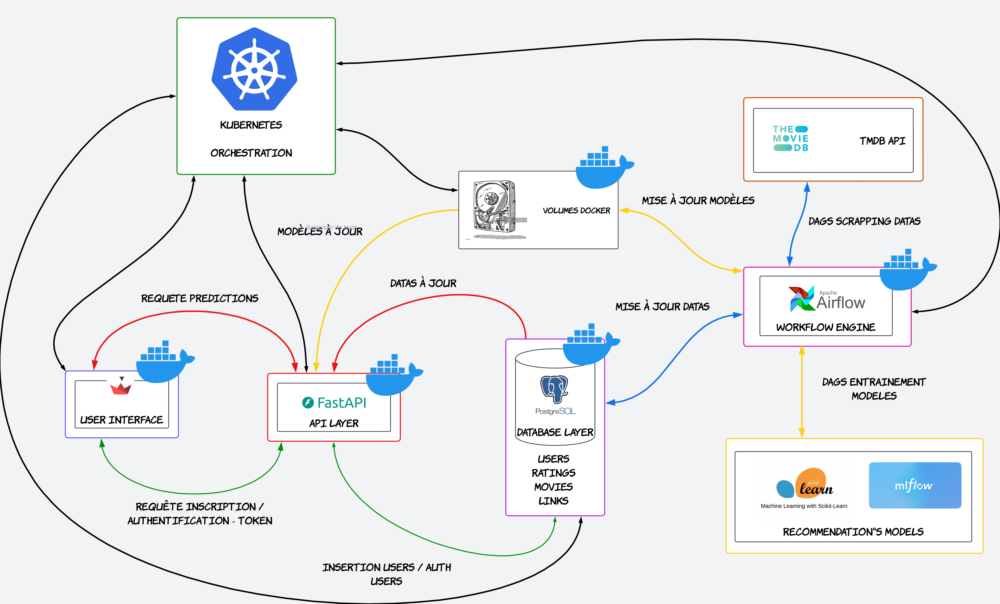

# Introduction

Dans le cadre de notre formation en Machine Learning Operations (MLOps) dispensée par Datascientest, nous avons l'opportunité d'explorer la mise en production et le monitoring d'une API dédiée à la recommandation de films. Ce projet vise à allier théorie et pratique en développant une solution robuste qui non seulement prédit les films susceptibles d'intéresser les utilisateurs, mais assure également un suivi constant de la performance de l'API.

## Objectifs du Projet

- **Développement d'une API Performante** : Créer une API capable de fournir des recommandations de films basées sur des données utilisateurs et des modèles d'apprentissage automatique.
- **Mise en Production** : Déployer l'API dans un environnement de production pour garantir son accessibilité et sa fiabilité.
- **Monitoring Efficace** : Mettre en place des outils de surveillance pour suivre la disponibilité, les performances et les éventuelles erreurs de l'API, assurant ainsi une expérience utilisateur optimale.

## Pourquoi ce Projet ?

Avec l'essor des services de streaming et la demande croissante pour des recommandations personnalisées, ce projet s'inscrit dans une tendance actuelle du marché. En intégrant des pratiques de MLOps, nous visons à garantir que notre solution soit non seulement fonctionnelle, mais aussi scalable et maintenable. Le monitoring joue un rôle crucial dans cette démarche, permettant d'anticiper les problèmes avant qu'ils n'affectent l'utilisateur final.

Ce repository est donc un témoignage de notre apprentissage et de notre capacité à développer des solutions innovantes dans le domaine du Machine Learning et des API. Nous vous invitons à explorer le code, à tester l'API et à contribuer à son amélioration.

## Organisation du projet

```

├── LICENSE
├── README.md
├── app                         # Dossier principal contenant les différentes applications
│ ├── docker-compose.yml        # Fichier de configuration pour Docker Compose
│ ├── fastapi                   # Dossier pour l'application FastAPI
│ │ ├── Dockerfile              # Fichier pour construire l'image Docker de l'application FastAPI
│ │ ├── app                     # Dossier contenant le code source de l'application FastAPI
│ │ │ ├── README.md
│ │ │ ├── auth.py               # Module pour la gestion de l'authentification
│ │ │ ├── database.py           # Module pour la gestion de la base de données
│ │ │ ├── main.py               # Point d'entrée principal de l'application FastAPI
│ │ │ ├── model
│ │ │ ├── models.py             # Modèle pour classe user
│ │ │ ├── predict.py            # Module pour la gestion des recommandations
│ │ │ ├── raw                   # Dossier pour les données brutes utilisées par l'application
│ │ └── requirements.txt        # Liste des dépendances Python nécessaires pour FastAPI
│ ├── model-trainer-predictor   # Dossier pour le module d'entraînement et de prédiction du modèle
│ │ ├── Dockerfile              # Fichier pour construire l'image Docker du modèle KNN
│ │ ├── app                     # Dossier contenant le code source pour le modèle KNN
│ │ └── requirements.txt        # Liste des dépendances Python nécessaires pour le modèle KNN
│ ├── prometheus                # Dossier pour la configuration de Prometheus (monitoring)
│ │ └── prometheus.yml          # Fichier de configuration pour Prometheus
│ └── streamlit                 # Dossier pour l'application Streamlit
│ ├── Dockerfile                # Fichier pour construire l'image Docker de l'application Streamlit
│ ├── app                       # Dossier contenant le code source de l'application Streamlit
│ │ ├── **init**.py
│ │ ├── app.py                  # Point d'entrée principal de l'application Streamlit
│ │ ├── images                  # Dossier contenant les images utilisées dans l'application Streamlit
│ │ └── pages                   # Dossier contenant les différentes pages de l'application Streamlit
│ └── requirements.txt          # Liste des dépendances Python nécessaires pour Streamlit
├── notebooks                   # Dossier contenant les notebooks Jupyter pour l'exploration et le développement
├── references                  # Dossier pouvant contenir des références bibliographiques ou autres documents pertinents
├── reports                     # Dossier destiné aux rapports
└── src                         # Dossier source contenant le code principal du projet

---