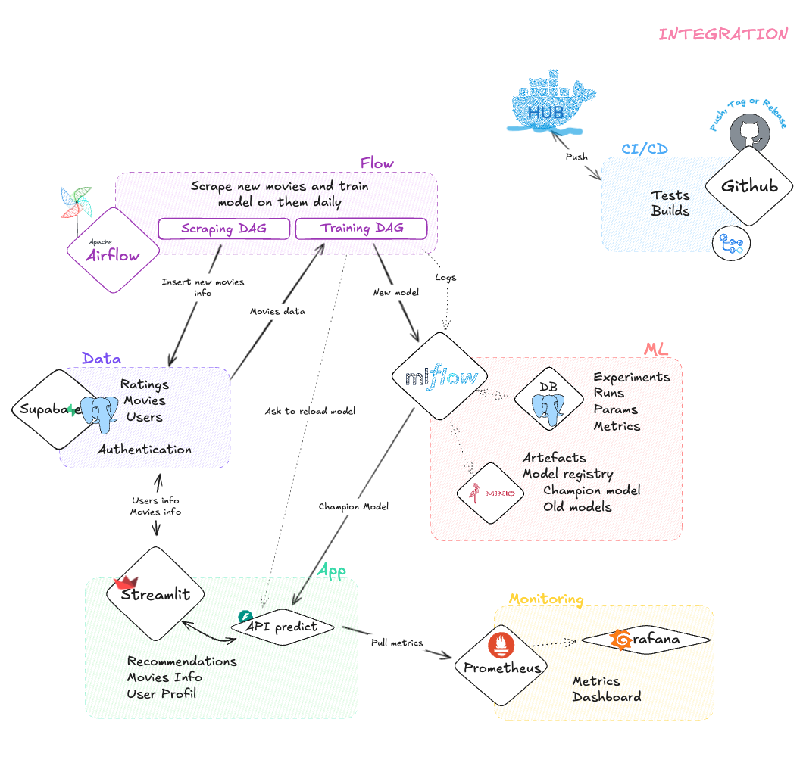
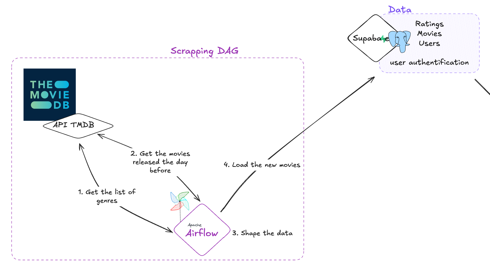
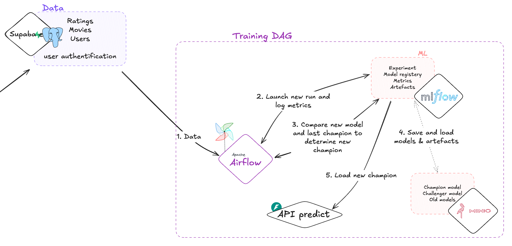
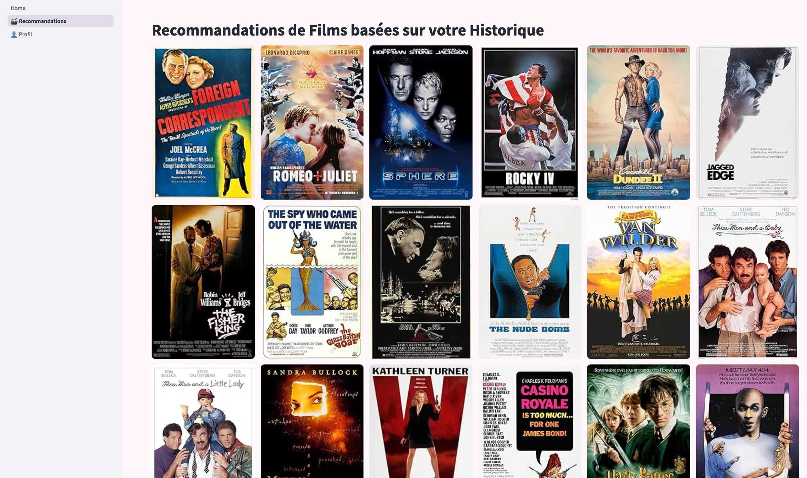
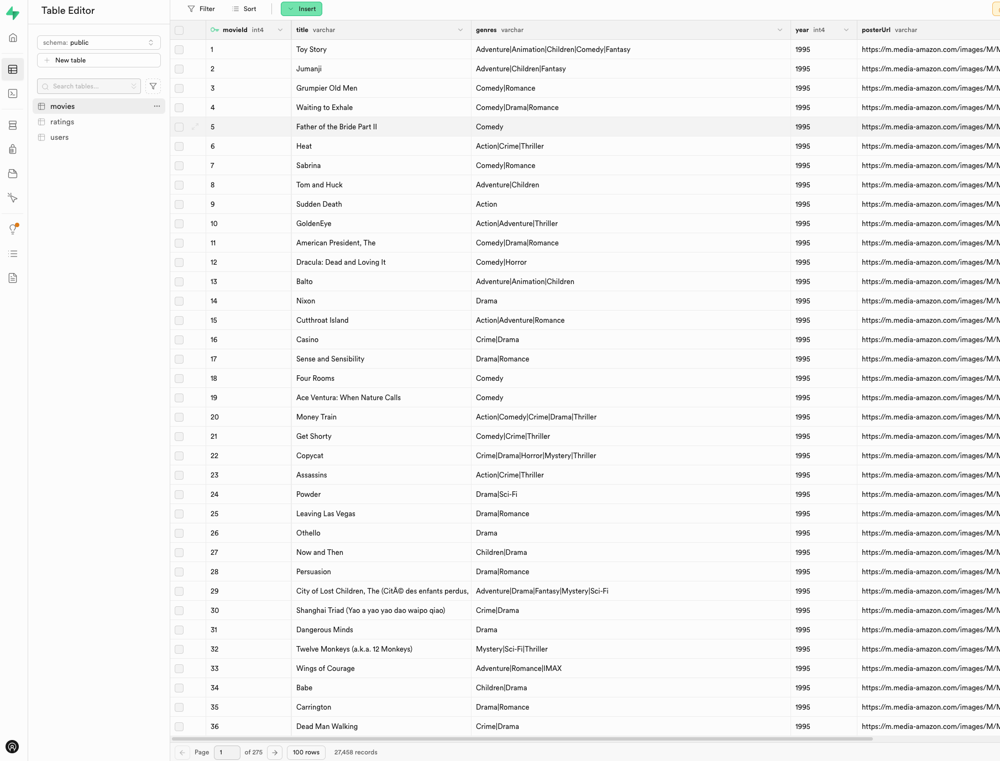

 <a name="readme-top"></a>

<div align="center">

<a href="" target="_blank" title="Go to  website">

</a>

# Movie Recommendation MLOps Project

System of recommendation of movies based on the user's profile and preferences.

</div>
<div align="center"><h4><a href="#-about-the-project">ℹ️ About the Project</a> • <a href="#-showcase">🏞 Showcase</a> • <a href="#-features">⭐️ Features</a> • <a href="#-stack-tech">🛠 Stack Tech</a> • <a href="#-setup">⚙ ️Setup</a> • <a href="#-from-here-have-fun">🎉 Have fun!</a> • <a href="#-about-the-authors">👨🏻‍ About the Authors</a> • <a href="#-license">📖 License</a></h4></div>

## ℹ️ About the Project

This project is a starting pack for MLOps projects focused on the subject of "movie recommendation". It provides a structured framework to develop, train, and deploy machine learning models for recommending movies to users. It uses Supabase for the backend, Airflow for the orchestration, MLflow for the tracking, Minio for the storage of the models, Prometheus and Grafana for the monitoring.


## 🏞 Showcase

<p align="center"></p>

<center>
<table>
<tr>
<td><a href="assets/images/dmp_s_1.png"></a></td>
<td><a href="assets/images/dmp_s_2.png"></a></td>
</tr>
<tr>
<td><a href="assets/images/dmp_s_3.jpeg"></a></td>
<td><a href="assets/images/dmp_s_4.png"></a></td>
</tr>
</table>
</center>

## Project Organization

The project is organized as follows:

```
├── .github
│   └── workflows
│       ├── test-api.yml                    <- GitHub Actions workflow for testing the API.
│       └── build-and-push-images.yml       <- GitHub Actions workflow for building and pushing the images.
│
├── airflow
│   ├── config                           
│   ├── dags
│   │   ├── scraping_new_movies.py          <- DAG for scraping new movies.
│   │   └── train_model_dag.py              <- DAG for training the model.
│   │
│   ├── logs
│   ├── plugins
│   ├── Dockerfile
│   ├── docker-compose.override.yaml
│   ├── docker-compose.yaml
│   └── requirements.txt
│
├── app
│   ├── api
│   │   └── predict
│   │       ├── Dockerfile
│   │       ├── main.py                     <- Main file for the API.
│   │       ├── metrics.py                  <- Metrics for the API.
│   │       └── requirements.txt            <- Requirements for the API.
│   │
│   ├── streamlit
│   │   ├── pages
│   │   │   ├── 1_Recommandations.py        <- Page for recommendations.
│   │   │   └── 2_Profil.py                 <- Page for the profile.
│   │   ├── Dockerfile
│   │   ├── Home.py                         <- Main page.
│   │   ├── requirements.txt                <- Requirements for the Streamlit app.
│   │   ├── style.css                       <- CSS for the pages.
│   │   ├── supabase_auth.py                <- Supabase authentication.
│   │   └── utils.py                        <- Utility functions.
│   │
│   └── docker-compose.yml                  <- Docker compose file for the Streamlit app and the API.
│
├── ml
│   ├── models
│   │   └── model.pkl                       <- Initial trained model.
│   └── src
│       ├── data
│       │   ├── check_structure.py          <- Script for checking the structure of the data.
│       │   ├── import_raw_data.py          <- Script for importing raw data.
│       │   └── load_data_in_db.py          <- Script for loading data into the database.
│       ├── features
│       │   └── build_features.py           <- Script for building features.
│       ├── models
│       │   ├── predict_model.py            <- Script for making predictions.
│       │   └── train_model.py              <- Script for training the model.
│       └── requirements.txt                <- Requirements for the project.
│
├── mlflow
│   ├── docker-compose.yml
│   ├── Dockerfile
│   └── requirements.txt
│
├── monitoring
│   ├── grafana
│   │   └── provisioning
│   │       ├── dashboards
│   │       │   ├── api_dashboard.json      <- Dashboard for the API.
│   │       │   └── dashboards.yml          <- Dashboards configuration.
│   │       └── datasources
│   │           └── datasource.yml          <- Datasource configuration.
│   └── prometheus
│   │   └── prometheus.yml                  <- Prometheus configuration.
│   │
│   └── docker-compose.yml
│
├── supabase
│   ├── README.md
│   ├── docker-compose.override.yml
│   ├── docker-compose.s3.yml
│   ├── docker-compose.yml
│   └── volumes
│       ├── api
│       │   └── kong.yml
│       ├── db
│       │   ├── _supabase.sql
│       │   ├── init
│       │   │   ├── 01-project-tables.sql    <- SQL script for creating project tables.
│       │   │   ├── 02-auth-trigger.sql      <- SQL script for creating the auth trigger.
│       │   │   ├── 03-security-policies.sql <- SQL script for creating security policies.
│       │   │   └── data.sql
│       │   ├── jwt.sql
│       │   ├── logs.sql
│       │   ├── pooler.sql
│       │   ├── realtime.sql
│       │   ├── roles.sql
│       │   └── webhooks.sql
│       ├── functions
│       │   ├── hello
│       │   │   └── index.ts
│       │   └── main
│       │       └── index.ts
│       ├── logs
│       │   └── vector.yml
│       └── pooler
│           └── pooler.exs
│
├── tests
│   ├── requirements.txt                    <- Requirements for the tests.
│   ├── test_api_predict.py                 <- Test for the API.
│   └── test_rls.py                         <- Test for the RLS.
│
├── .env.example                            <- Example of the .env file.
├── .gitignore                              <- Git ignore file.
├── LICENSE
├── Makefile                                <- Makefile for the project.
├── README.md                               <- This README file.
├── requirements-dev.txt
└── requirements-ref.txt
```

## ⭐️ Features

- Very basic model to recommend movies.
- Scraping new movies from The Movie Database (TMDB) API.
- Training a machine learning model to recommend movies.
- Deploying the model as a REST API.
- Building an interactive web app to display recommendations.
- Orchestrating the workflow with Apache Airflow.
- Monitoring the system with Prometheus and Grafana.

## 🛠 Stack Tech

- **Python**: The main programming language used for data processing, model training, and prediction.
- **Docker & Docker Compose**: Used for containerizing the application and setting up a local development environment.
- **Supabase**: A backend service for managing the database and authentication.
- **MLflow**: For tracking experiments and managing machine learning models.
- **Apache Airflow**: For orchestrating data workflows and model training pipelines.
- **Streamlit**: For building interactive web applications to display recommendations.
- **FastAPI**: For building the REST API for the movie recommendation service.
- **Prometheus**: For monitoring and alerting.
- **Grafana**: For visualizing metrics.

## ⚙ ️Setup

Make sure you have the following tools installed:
Docker, Docker Compose, Python 3.10+, pip, git et make
   ```bash
   docker --version
   docker compose version
   python --version
   pip --version
   git --version
   make --version
   ```

To set up the project for local development, from the root of the repository follow the steps below:

1. Run the `make setup1` command.

2. Set the environment variable TMDB_API_TOKEN in the .env file. This is necessary to be able to execute the DAG `scraping_new_movies.py` in Airflow. You can get a token [here](https://www.themoviedb.org/settings/api).

3. Run the `make setup2` command.

4. Run the `make start` command.

5. Setup access and the bucket for MLFlow:
   - Access MinIO console at `localhost:9001` and sign in with root credentials from `.env`
   - Create access key and save the generated keys
   - Create a bucket named `mlflow`
   - Update `.env` with your access/secret keys and restart the containers:
     ```bash
     cd mlflow
     docker compose down
     docker compose --env-file ../.env up -d --build
     ```

6. Secrets for the GitHub Actions workflow:
   - In order to push the images to the Docker Hub registry, you need to create a personal access token with the necessary permissions.
   - Add the token (read and write) for the Docker Hub registry as a secret with the name `DOCKERHUB_TOKEN`.
   - Add the username for the Docker Hub registry as a secret with the name `DOCKERHUB_USERNAME`.


**Local access to the Services**:
- Supabase: [http://localhost:8000](http://localhost:8000)
- Airflow: [http://localhost:8080](http://localhost:8080)
- Streamlit: [http://localhost:8501](http://localhost:8501)
- API: [http://localhost:8002/docs](http://localhost:8002/docs)
- MLFlow: [http://localhost:5001](http://localhost:5001)
- MinIO: [http://localhost:9001](http://localhost:9001)
- Prometheus: [http://localhost:9090](http://localhost:9090)
- Grafana: [http://localhost:3000](http://localhost:3000)

## 🎉 From here have fun!

#### First recommendations
You can open the Streamlit app, create an account and have your first recommendations!

In order for the app to work you need to use an email with a number just before the @ symbol (ex: `user1@example.com`, `user20@example.com`, etc.). It'll allow you to have an existing profil linked to your account.

#### Run the DAGs
You can run the DAGs in Airflow to scrape new movies and train the model.

#### Analyse the model in MLFlow
You can explore the artefacts, metrics and logs of the model in MLFlow if you runned the training DAG.

#### Explore Prometheus and Grafana
You can explore the metrics in Grafana's dashboard.

#### Explore Supabase
You can explore the database in Supabase's dashboard.

## 👨🏻‍ About the Authors

**Sarah Hemmel**

**Mikhael Benilouz**

**Antoine Pelamourgues**

## 📖 License

This project is licensed under the [MIT License](https://opensource.org/licenses/MIT).


<p align="right"><a href="#readme-top">Top ⬆️</a></p>

---
 <div align="center">Built with ❤️</div>
